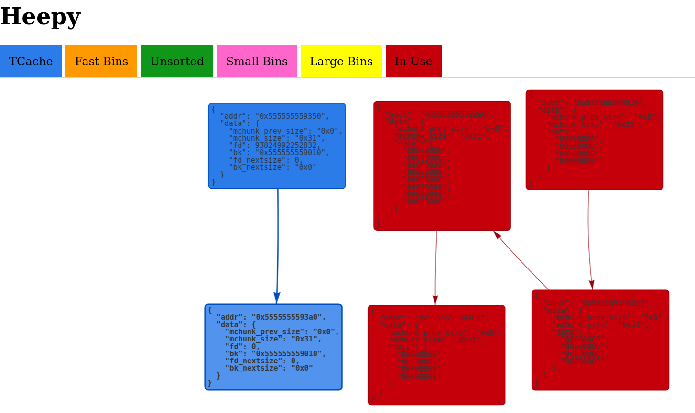

# heepy


A heap visualizer for normal folks.
 

## Dependencies

This depends on pip and npm (a relatively recent version; developed on v14.0.0) as well as git and tmux.

# Installation

```
cd backend && pip install -r requirements.txt
cd ../visualizer && npm install
cd ../visualizer/alloxtract && npm install && npm run run
cd ../..
```

# Usage

```
./heepy.sh ./binary [ ./libc.so.6 ]
```

Test heap programs are provided in test-bins (notably playground and crud).


# How it works

Heepy uses gdb it interact with your binary, and a node graph visualization library to visualize the heap. In order to parse heap data structures correctly, we extracted type information from malloc.c, which has been jsonified. That logic is in the `alloxtract/` directory.
